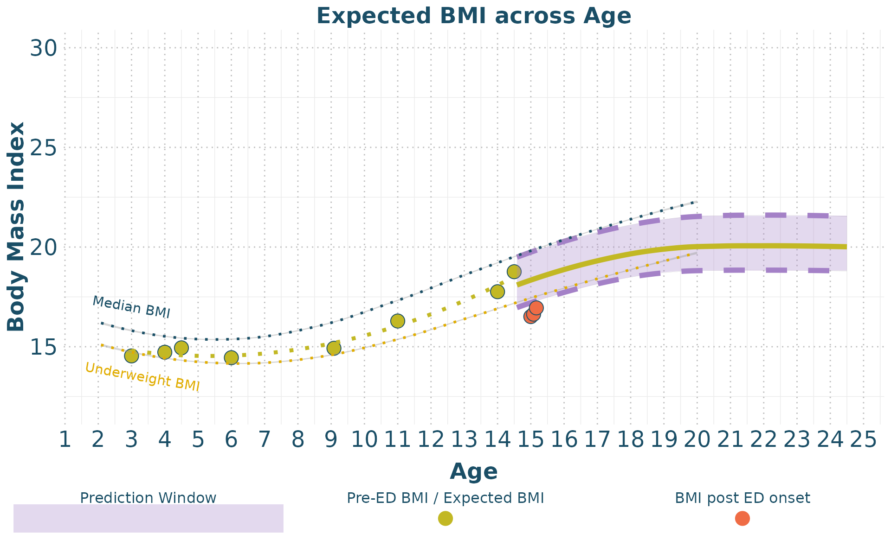
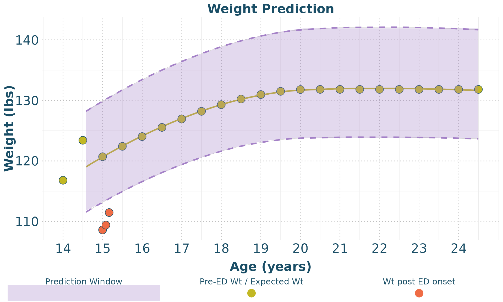
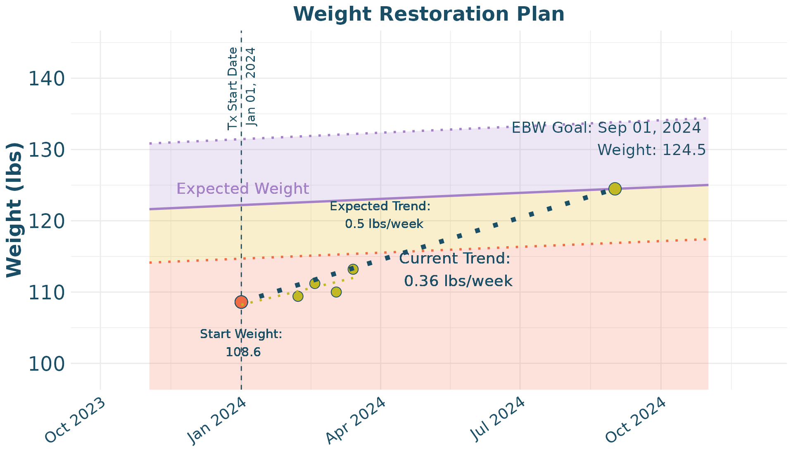

# TeenGrowth Vignette

## Introduction

This vignette provides a detailed walkthrough on how to use the
TeenGrowth package to forecast and visualize BMI data. This guide will
cover data cleaning, BMI forecasting, and plotting the results. The
TeenGrowth R package is designed for use by eating disorder researchers
who have familiarity with R and are interested in forecasting BMI data.
For those who are interested in clinical applications of the package
through an app, please refer to the [TeenGrowth Shiny
app](https://embark-lab.shinyapps.io/teengrowthapp/).

### Clean Data

The first step is to clean the data using the clean_data function. This
function prepares the data by standardizing column names and units.

``` r
clean_data = clean_data(demo,
                        id_col_name = 'participant', 
                        age_col_name = 'age',
                        sex_col_name = 'sex',
                        ht_col_name = 'height',
                        wt_col_name = 'weight',
                        adult_ht_col_name = 'adult_height_in', 
                        ed_aoo_col_name = 'ed_aoo', 
                        ht_unit = 'in', 
                        wt_unit = 'lb')
```

### Create BMI Forecasts

Next, we generate BMI forecasts using the forecast_bmi function. This
function calculates future BMI values based on the provided data. For
the following example, we use the mean BMIz prior to eating disorder
onset as our central value for prediction, with a 95% prediction
interval.

``` r
BMI_forecast <- forecast_bmi(
             data = clean_data, 
             central_value = "mean",
             ci = 95)
```

### Plot Data

We can now visualize the cleaned data and the BMI forecasts. The
`plot_eBMI` function is used to plot the estimated BMI data, while the
`plot_weight` function plots the weight data.

``` r
plot_eBMI(clean_data = clean_data, 
          forecast_data = BMI_forecast, 
          px = 2)
```



``` r
plot_weight(clean_data = clean_data, 
          forecast_data = BMI_forecast, 
          px = 2)
```



## 10-year BMI and Weight Forecasts

An additional function, `clean_forecast_data` allows for the creation of
a table that organizes 10-year forecast data (in 6-month age intervals)
for expected BMI and Weight

``` r
forecast_data <- clean_forecast_data(BMI_forecast, 
                    px = 2, 
                    model = 'mean')
knitr::kable(forecast_data)
```

|  Age | Expected BMI      | Expected Weight (lbs) | Expected Weight (kgs) |
|-----:|:------------------|:----------------------|:----------------------|
| 15.0 | 18.4 (17.2, 19.7) | 120.7 (113.2, 129.9)  | 54.8 (51.4, 58.9)     |
| 15.5 | 18.6 (17.5, 20)   | 122.4 (114.9, 131.7)  | 55.5 (52.1, 59.7)     |
| 16.0 | 18.9 (17.7, 20.3) | 124 (116.5, 133.4)    | 56.3 (52.8, 60.5)     |
| 16.5 | 19.1 (17.9, 20.5) | 125.5 (117.9, 134.9)  | 56.9 (53.5, 61.2)     |
| 17.0 | 19.3 (18.1, 20.7) | 126.9 (119.3, 136.4)  | 57.6 (54.1, 61.9)     |
| 17.5 | 19.5 (18.3, 20.9) | 128.2 (120.6, 137.7)  | 58.1 (54.7, 62.4)     |
| 18.0 | 19.7 (18.5, 21.1) | 129.3 (121.6, 138.8)  | 58.6 (55.2, 63)       |
| 18.5 | 19.8 (18.6, 21.3) | 130.2 (122.5, 139.8)  | 59.1 (55.6, 63.4)     |
| 19.0 | 19.9 (18.7, 21.4) | 131 (123.2, 140.7)    | 59.4 (55.9, 63.8)     |
| 19.5 | 20 (18.8, 21.5)   | 131.5 (123.6, 141.3)  | 59.6 (56.1, 64.1)     |
| 20.0 | 20 (18.8, 21.6)   | 131.8 (123.8, 141.8)  | 59.8 (56.2, 64.3)     |
| 20.5 | 20 (18.8, 21.6)   | 131.8 (123.8, 141.9)  | 59.8 (56.2, 64.4)     |
| 21.0 | 20 (18.8, 21.6)   | 131.8 (123.8, 141.9)  | 59.8 (56.2, 64.4)     |
| 21.5 | 20 (18.8, 21.6)   | 131.8 (123.8, 141.9)  | 59.8 (56.2, 64.4)     |
| 22.0 | 20 (18.8, 21.6)   | 131.8 (123.8, 141.9)  | 59.8 (56.2, 64.4)     |
| 22.5 | 20 (18.8, 21.6)   | 131.8 (123.8, 141.9)  | 59.8 (56.2, 64.4)     |
| 23.0 | 20 (18.8, 21.6)   | 131.8 (123.8, 141.9)  | 59.8 (56.2, 64.4)     |
| 23.5 | 20 (18.8, 21.6)   | 131.8 (123.8, 141.9)  | 59.8 (56.2, 64.4)     |
| 24.0 | 20 (18.8, 21.6)   | 131.8 (123.8, 141.9)  | 59.8 (56.2, 64.4)     |
| 24.5 | 20 (18.8, 21.6)   | 131.8 (123.8, 141.9)  | 59.8 (56.2, 64.4)     |

## Weight Restoration Planning

Finally, we provide an example of how to use the package for treatment
planning. In this case, a specific participant is identified, then the
data is prepared for plotting with `tx_plot_clean`, and then a weight
restoration plot is able to be derived using the `Wt_Restore_Plot`
function.

``` r

wt_restore <- demo |> filter(participant == 2)
wt_restore_clean <-     tx_plot_clean(wt_restore,
                        age_col_name = 'age',
                        age_unit = 'years',
                        ht_col_name = 'height',
                        wt_col_name = 'weight',
                        adult_ht = wt_restore$adult_height_in[1],
                        sex = wt_restore$sex[1],
                        ht_unit = 'in', 
                        wt_unit = 'lb', 
                        dob = '2009-01-01', 
                        tx_start_date = '2024-01-01')

  
wt_restore_forecast <- BMI_forecast |> filter (id == 2)
  

Wt_Restore_Plot(wt_restore_clean, 
                wt_restore_forecast, 
                slope_per_week = 0.5)
```


