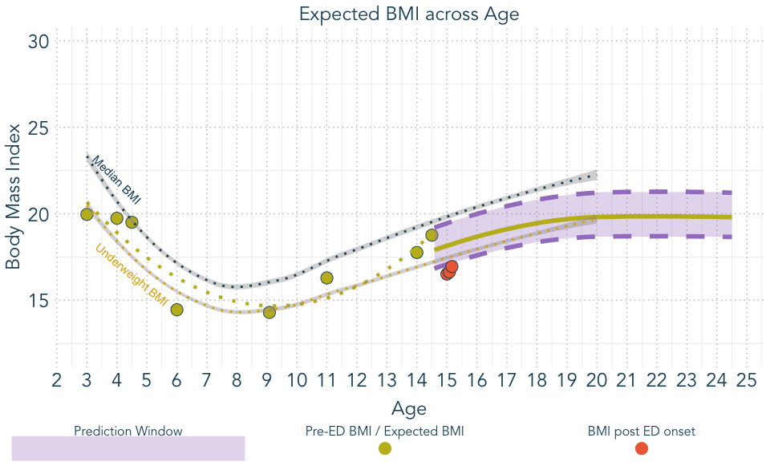
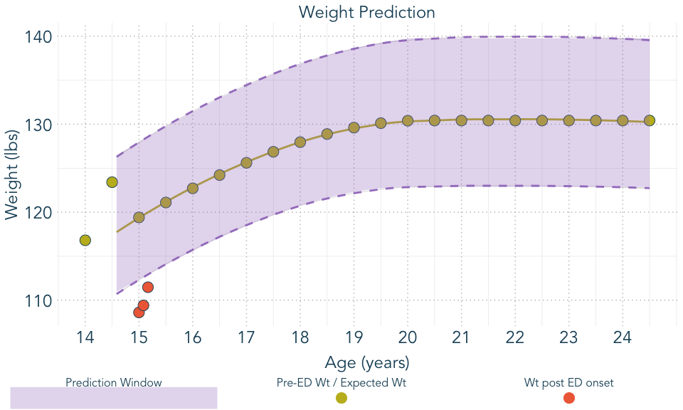
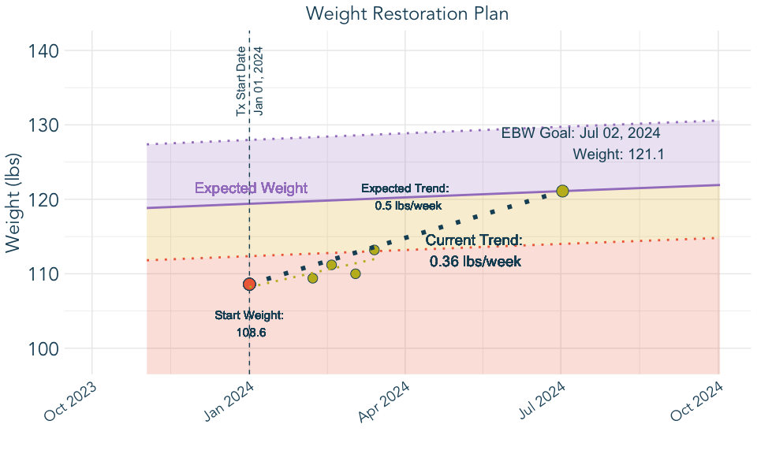

TeenGrowth Vignette
================
Katherine Schaumberg
2024-07-11

# Introduction

This vignette provides a detailed walkthrough on how to use the
TeenGrowth package to forecast and visualize BMI data. This guide will
cover data cleaning, BMI forecasting, and plotting the results.

## Clean Data

The first step is to clean the data using the clean_data function. This
function prepares the data by standardizing column names and units.

``` r
clean_data = clean_data(demo,
                        id_col_name = 'participant', 
                        age_col_name = 'age',
                        sex_col_name = 'sex',
                        ht_col_name = 'height',
                        wt_col_name = 'weight',
                        adult_ht_col_name = 'adult_height_in', 
                        ed_aoo_col_name = 'ed_aoo', 
                        ht_unit = 'in', 
                        wt_unit = 'lb')
```

## Create BMI Forecasts

Next, we generate BMI forecasts using the forecast_bmi function. This
function calculates future BMI values based on the provided data.

``` r
BMI_forecast <- forecast_bmi(
             data = clean_data, 
             central_value = "mean",
             ci = 95)
```

## Plot Data

We can now visualize the cleaned data and the BMI forecasts. The
`plot_eBMI` function is used to plot the estimated BMI data, while the
`plot_weight` function plots the weight data.

``` r
plot_eBMI(clean_data = clean_data, 
          forecast_data = BMI_forecast, 
          px = 2)
```

<!-- -->

``` r
plot_weight(clean_data = clean_data, 
          forecast_data = BMI_forecast, 
          px = 2)
```

<!-- -->

# 10-year BMI and Weight Forecasts

An additional function, `clean_forecast_data` allows for the creation of
a table that organizes 10-year forecast data (in 6-month age intervals)
for expected BMI and Weight

``` r
forecast_data <- clean_forecast_data(BMI_forecast, 
                    px = 2, 
                    model = 'mean')
knitr::kable(forecast_data)
```

|  Age | Expected BMI      | Expected Weight (lbs) | Expected Weight (kgs) |
|-----:|:------------------|:----------------------|:----------------------|
| 15.0 | 18.2 (17.1, 19.5) | 119.4 (112.4, 128)    | 54.2 (51, 58.1)       |
| 15.5 | 18.4 (17.3, 19.7) | 121.1 (114, 129.7)    | 54.9 (51.7, 58.9)     |
| 16.0 | 18.7 (17.6, 20)   | 122.7 (115.6, 131.4)  | 55.7 (52.4, 59.6)     |
| 16.5 | 18.9 (17.8, 20.2) | 124.2 (117.1, 133)    | 56.3 (53.1, 60.3)     |
| 17.0 | 19.1 (18, 20.4)   | 125.6 (118.4, 134.4)  | 57 (53.7, 61)         |
| 17.5 | 19.3 (18.2, 20.6) | 126.9 (119.7, 135.7)  | 57.5 (54.3, 61.5)     |
| 18.0 | 19.5 (18.4, 20.8) | 128 (120.7, 136.8)    | 58 (54.8, 62.1)       |
| 18.5 | 19.6 (18.5, 21)   | 128.9 (121.6, 137.8)  | 58.5 (55.2, 62.5)     |
| 19.0 | 19.7 (18.6, 21.1) | 129.6 (122.3, 138.6)  | 58.8 (55.5, 62.9)     |
| 19.5 | 19.8 (18.7, 21.2) | 130.1 (122.7, 139.3)  | 59 (55.7, 63.2)       |
| 20.0 | 19.8 (18.7, 21.2) | 130.4 (122.9, 139.7)  | 59.1 (55.7, 63.4)     |
| 20.5 | 19.8 (18.7, 21.2) | 130.4 (122.9, 139.8)  | 59.2 (55.7, 63.4)     |
| 21.0 | 19.8 (18.7, 21.2) | 130.4 (122.9, 139.8)  | 59.2 (55.7, 63.4)     |
| 21.5 | 19.8 (18.7, 21.2) | 130.4 (122.9, 139.8)  | 59.2 (55.7, 63.4)     |
| 22.0 | 19.8 (18.7, 21.2) | 130.4 (122.9, 139.8)  | 59.2 (55.7, 63.4)     |
| 22.5 | 19.8 (18.7, 21.2) | 130.4 (122.9, 139.8)  | 59.2 (55.7, 63.4)     |
| 23.0 | 19.8 (18.7, 21.2) | 130.4 (122.9, 139.8)  | 59.2 (55.7, 63.4)     |
| 23.5 | 19.8 (18.7, 21.2) | 130.4 (122.9, 139.8)  | 59.2 (55.7, 63.4)     |
| 24.0 | 19.8 (18.7, 21.2) | 130.4 (122.9, 139.8)  | 59.2 (55.7, 63.4)     |
| 24.5 | 19.8 (18.7, 21.2) | 130.4 (122.9, 139.8)  | 59.2 (55.7, 63.4)     |

# Weight Restoration Planning

Finally, we provide an example of how to use the package for treatment
planning. In this case, a specific participant is identified, then the
data is prepared for plotting with `tx_plot_clean`, and then a weight
restoration plot is able to be derived using the `Wt_Restore_Plot`
function.

``` r

wt_restore <- demo |> filter(participant == 2)
wt_restore_clean <-     tx_plot_clean(wt_restore,
                        age_col_name = 'age',
                        age_unit = 'years',
                        ht_col_name = 'height',
                        wt_col_name = 'weight',
                        adult_ht = wt_restore$adult_height_in[1],
                        ht_unit = 'in', 
                        wt_unit = 'lb', 
                        dob = '2009-01-01', 
                        tx_start_date = '2024-01-01')

  
wt_restore_forecast <- BMI_forecast |> filter (id == 2)
  

Wt_Restore_Plot(wt_restore_clean, 
                wt_restore_forecast, 
                slope_per_week = 0.5)
```

<!-- -->
